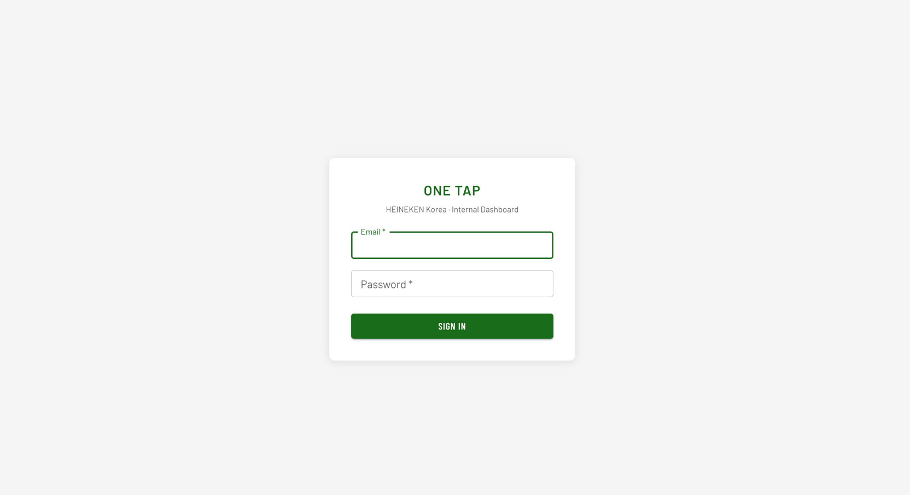

# ONE TAP — Market Data Dashboard

HEINEKEN Korea 내부용 오프 프리미스 시장 분석 대시보드입니다.

---

## 🚀 실행 방법

```bash
npm install
npm run dev
```

[http://localhost:3000](http://localhost:3000) 에서 확인할 수 있습니다.

---

## 🛠 기술 스택

| 역할 | 종류 |
|-|-|
| Framework |  |
| Language |  |
| UI Library |  |
| Charts |  |
| Auth & Storage |  |
| CSV Parsing |  |
| Package Manager |  |
| CI/CD |  |

---

## 🔐 로그인

아래 계정으로 로그인하면 대시보드를 이용할 수 있습니다.

<!-- 로그인 페이지 스크린샷 -->

> 접근 권한이 필요한 경우 담당자에게 문의하세요.
